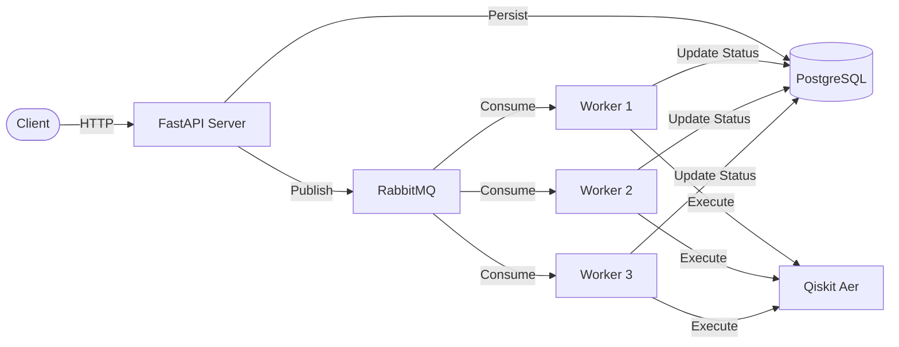
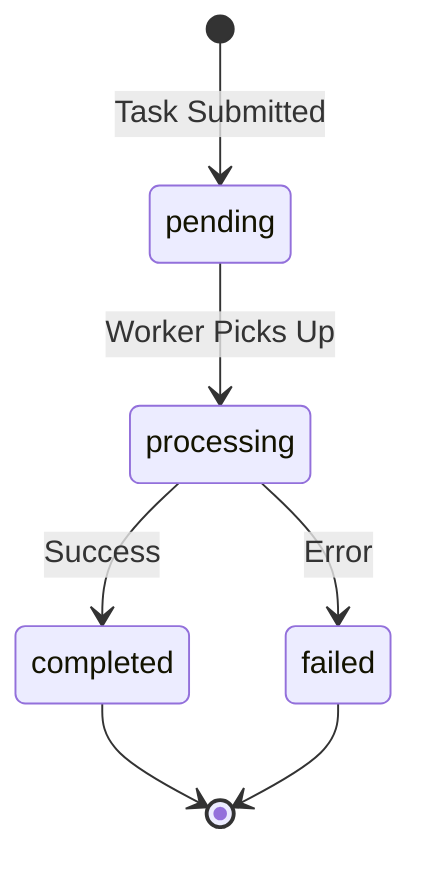

# Quantum Circuit Task Queue

Asynchronous quantum circuit execution system with REST API, persistent task queue, and horizontal worker scaling.

## Architecture



## Development Process
The project was developed using claude-code and [speckit](https://github.com/github/spec-kit)
(The specs for each feature can be found under /specs/)

The project stack is Python 3.11, FastAPI, RabbitMQ, PostgreSQL, and Qiskit Aer.
and it has 4 components: DB, Queue, API, Workers.

In a real production scenario, you wouldn't deploy the DB as part of the container, and depending on your system, the queues would probably be managed by the cloud provider. But for this example, the docker-compose setup includes the API, 3 workers, DB, and queue as separate containers.

Because no load was requested in the instructions, I decided to go with:
**60 tasks/sec** (assumption based on reasonable quantum developer usage patterns).

* I think it's reasonable because there aren't many quantum developers 
* and the process of developing takes time. 
* We are also using a critical resource which has a low capacity (quantum computer).

We can easily scale horizontally by adding more workers, but we'd prefer k8s or lambdas at that point.

### Stack Decisions

#### DB
I decided to go with Postgres, for a couple of reasons:
* The scale is not high.
* I prioritize consistency over speed.
* I predict that the system is part of a larger system that needs to also keep member data, member preferences, track logins, etc which are easier to handle in a SQL DB.
* We are using Postgres strong consistency to make sure workers don't process the same message twice.

There are currently 2 tables: task and status_history.
* task manages the requests and their status.
* status_history keeps a log on the changes between the statuses, this table is more for insights.

#### Queue
This is the first time I'm using RabbitMQ. I've been working with SQS so I have strong familiarity with queues.

The queue is FIFO, persistent, at-least-once, and can store over ~4 million messages.

It currently stores unprocessed messages forever which can be an issue in high scale systems, but for the current exercise I think it's reasonable.

I decided not to use DLQ, all message's data and payload are stored in the DB and I decided that adding the DLQ will be redundant. Though in production I'd probably add one.


#### API
This is the app that manages client requests

**Task submission:**
* Validates structure
* Generates a correlation ID
* Inserts them to DB
* Pushes them to queue
* Returns task_id

**Task status:**
* Validates structure
* Fetches task data from DB
* Returns task data

**Health check:**
* Checks DB health
* Checks queue health

There is currently no health check for workers, since workers are stateless and pull from a shared queue, if individual workers fail, the remaining workers keep processing tasks.

#### Workers
These are the worker bees that push the job to the quantum computers using Qiskit.
Currently we only use the AER simulator.

Since RabbitMQ delivers messages at-least-once, we need to make sure the same task doesn't get picked up by multiple workers. So before processing, workers check the DB to verify the task status hasn't already been updated by another worker.

### Key Design Decisions

**Message Queue**: RabbitMQ provides reliable task distribution with message persistence, ensuring no task loss during restarts.

**Database**: PostgreSQL with async SQLAlchemy for task persistence and status tracking. Optimistic lock prevent race conditions in multi-worker scenarios.

**Execution Engine**: Qiskit Aer simulator executes circuits with configurable shots (1-100,000). QASM3 format chosen for standardization and compatibility.

**Horizontal Scaling**: Multiple worker instances consume from shared queue. Add workers by duplicating service definitions in docker-compose.yml.

**Observability**: Structured JSON logging with correlation IDs enables request tracing across API and worker services.

## Project Structure

```
classiq/
├── src/
│   ├── api/           # FastAPI server
│   ├── worker/        # Background task processor
│   ├── core/          # Shared business logic
│   │   ├── db/        # Database models & repository
│   │   ├── messaging/ # RabbitMQ pub/sub
│   │   ├── execution/ # Qiskit circuit execution
│   │   └── services/  # Business logic layer
│   └── common/        # Config, logging, utilities
├── tests/             # Integration tests (26 tests)
└── migrations/        # Alembic database migrations
```

## Quick Start

### Prerequisites

- Docker & Docker Compose
- Ports 5432, 5672, 8001 available

### Start the System

```bash
# Start all services
docker-compose up -d

# Verify health
curl http://localhost:8001/health

# View logs
docker-compose logs -f api worker-1
```

Services start in dependency order:
1. PostgreSQL (port 5432)
2. RabbitMQ (port 5672, management UI on 15672)
3. API server (port 8001)
4. Workers (3 instances)

## API Usage

### Submit Task

```bash
curl -X POST http://localhost:8001/tasks \
  -H "Content-Type: application/json" \
  -d '{
    "qc": "OPENQASM 3.0;\ninclude \"stdgates.inc\";\nqubit q;\nbit c;\nx q;\nc = measure q;",
    "shots": 100
  }'
```

**Response:**
```json
{
  "task_id": "123e4567-e89b-12d3-a456-426614174000",
  "message": "Task submitted successfully.",
  "submitted_at": "2025-12-30T10:30:45.123456Z",
  "correlation_id": "abc-123-def"
}
```

**Parameters:**
- `qc`: OpenQASM 3.0 circuit definition (required)
- `shots`: Number of executions (optional, default: 1024, range: 1-100,000)

### Get Task Status

```bash
curl http://localhost:8001/tasks/123e4567-e89b-12d3-a456-426614174000
```

**Response (Completed):**
```json
{
  "task_id": "123e4567-e89b-12d3-a456-426614174000",
  "status": "completed",
  "submitted_at": "2025-12-30T10:30:45.123456Z",
  "message": "Task completed successfully.",
  "result": {
    "counts": {"0": 0, "1": 100},
    "shots": 100,
    "success": true
  },
  "status_history": [
    {
      "status": "pending",
      "transitioned_at": "2025-12-30T10:30:45.123456Z",
      "notes": "Task created and queued"
    },
    {
      "status": "processing",
      "transitioned_at": "2025-12-30T10:30:46.234567Z",
      "notes": "Worker started processing"
    },
    {
      "status": "completed",
      "transitioned_at": "2025-12-30T10:30:47.345678Z",
      "notes": "Task completed successfully"
    }
  ],
  "correlation_id": "abc-123-def"
}
```

### Health Check

```bash
curl http://localhost:8001/health
```

**Response:**
```json
{
  "status": "healthy",
  "timestamp": "2025-12-30T10:30:00.000000Z",
  "database_status": "connected",
  "queue_status": "connected"
}
```

## Task Lifecycle



**States:**
- **pending**: Task persisted to DB, message published to queue
- **processing**: Worker consumed message, executing circuit
- **completed**: Circuit executed successfully, results stored
- **failed**: Circuit parsing or execution error

Workers implement idempotency checks - duplicate messages are safely ignored based on current task status.

## Example Workflows

### Bell State Circuit

Create entangled qubit pair and measure:

```bash
curl -X POST http://localhost:8001/tasks \
  -H "Content-Type: application/json" \
  -d '{
    "qc": "OPENQASM 3.0;\ninclude \"stdgates.inc\";\nqubit[2] q;\nbit[2] c;\nh q[0];\ncx q[0], q[1];\nc[0] = measure q[0];\nc[1] = measure q[1];",
    "shots": 1024
  }'

# Save task_id from response
TASK_ID="<task_id_from_response>"

# Poll for completion (typically <1 second)
curl http://localhost:8001/tasks/$TASK_ID
```

**Expected result**: ~50% `00`, ~50% `11` (entangled state collapses to correlated measurements).

### Single Qubit X-Gate

Flip qubit from |0⟩ to |1⟩:

```bash
curl -X POST http://localhost:8001/tasks \
  -H "Content-Type: application/json" \
  -d '{
    "qc": "OPENQASM 3.0;\ninclude \"stdgates.inc\";\nqubit q;\nbit c;\nx q;\nc = measure q;",
    "shots": 100
  }'
```

**Expected result**: 100% `1` (deterministic flip).

## Testing

```bash
# Run full integration test suite
docker-compose exec api pytest tests/integration/deployment -v

# Expected output: 26 passed
```

**Test coverage:**
- E2E workflow (submit → process → retrieve)
- Health checks (database + queue connectivity)
- Error handling (invalid circuits, malformed UUIDs)
- Queue persistence and message acknowledgment
- Schema validation and API contracts

## Technology Stack

| Component | Technology | Rationale |
|-----------|-----------|-----------|
| API Server | FastAPI 0.104 | Async framework with automatic OpenAPI docs |
| Database | PostgreSQL 15 + asyncpg | ACID guarantees, async support |
| ORM | SQLAlchemy 2.0 | Async ORM with type hints |
| Queue | RabbitMQ 3.12 + aio-pika | Message persistence, fair distribution |
| Execution | Qiskit 1.0 + Qiskit Aer | Production quantum simulator |
| Logging | structlog | JSON structured logs for parsing |
| Migrations | Alembic | Version-controlled schema changes |
| Container | Docker + uv | Multi-stage builds, fast installs |

## Monitoring

### RabbitMQ Management UI

```bash
open http://localhost:15672
# Credentials: quantum_user / quantum_pass
```

View queue depth, message rates, consumer activity, and connection health.

### Container Status

```bash
# Check all services
docker-compose ps

# Expected output (all healthy):
# quantum-api        Up (healthy)   0.0.0.0:8001->8000/tcp
# quantum-worker-1   Up (healthy)   8000/tcp
# quantum-worker-2   Up (healthy)   8000/tcp
# quantum-worker-3   Up (healthy)   8000/tcp
# quantum-postgres   Up (healthy)   0.0.0.0:5432->5432/tcp
# quantum-rabbitmq   Up (healthy)   0.0.0.0:5672->5672/tcp
```

### Logs

```bash
# All services
docker-compose logs -f

# Specific service
docker-compose logs -f worker-1

# Follow with correlation ID filter
docker-compose logs -f | grep "correlation_id=abc-123"
```

## API Documentation

Interactive OpenAPI documentation:
- **Swagger UI**: http://localhost:8001/docs
- **OpenAPI Schema**: http://localhost:8001/openapi.json

## Stopping the System

```bash
# Stop services (preserve data)
docker-compose down

# Stop and remove volumes (clear all data)
docker-compose down -v
```

---

**Status**: Production Ready
**Last Updated**: 2025-12-30
